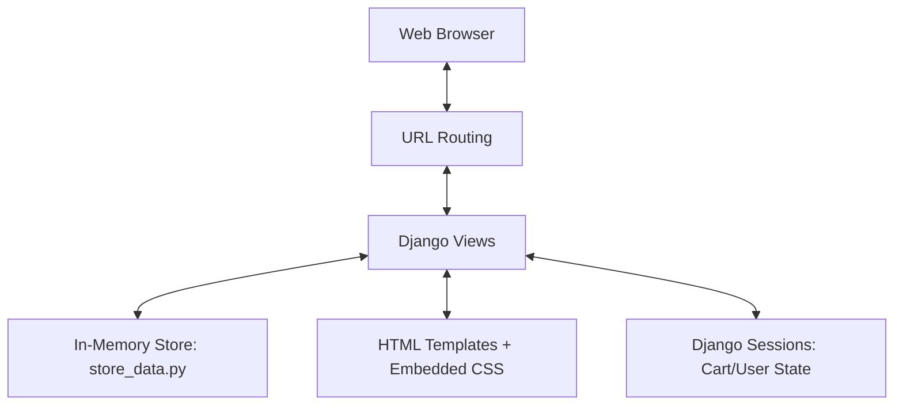

# 🛍️ MyShop - Premium E-Commerce Platform

MyShop is a modern, lightweight, and fully functional e-commerce application built with Django. It features a sleek, responsive design and a fast in-memory data store for seamless development.

## 🚀 Quick Start

### 1. Prerequisites
- Python 3.8+
- Django 5.x

### 2. Installation
Clone the repository and navigate to the project folder:
```bash
git clone git@github.com:muddadahyma/myshop.git
cd myshop
```

### 3. Run the Server
```bash
python manage.py runserver
```
Visit the app at [http://127.0.0.1:8000/](http://127.0.0.1:8000/)

---

## 🛠️ Technologies Used

- **Backend**: Python 3.11, Django 5.2 (MVT Architecture)
- **Frontend**: HTML5, Vanilla CSS3 (Embedded), Inter Google Font
- **State Management**: Django Sessions (for Shopping Cart & User Auth)
- **Database**: In-memory Python Data Structures (Simulating a real DB for rapid prototyping)

---

## 🏗️ Architecture

The project follows the standard Django **Model-View-Template (MVT)** pattern, but optimizes for speed by using a central `store_data.py` module to manage application state.

### Architecture Diagram


---

## ✨ Key Features

- **Dynamic Product Catalog**: Search and filter products by categories.
- **Shopping Cart**: Add, remove, and update quantities with real-time totals.
- **User Authentication**: Secure login and signup flow.
- **User Dashboard**: View order history and personalized stats.
- **Checkout Flow**: End-to-end order placement with "Cash on Delivery" support.
- **Premium Design**: Modern, clean UI with a professional color palette.

---

## 👤 Default Accounts
- **Admin**: `admin@myshop.com` / `admin123`
- **Customer**: Feel free to sign up and create your own!

---

## 📁 Project Structure
- `core/`: Project configuration (settings, urls, wsgi).
- `home/`, `login/`, `signup/`, `menu/`, `orders/`, `dashboard/`: Feature-specific apps.
- `templates/`: Clean, modular HTML templates.
- `manage.py`: Django management script.

---

© 2026 MyShop Platform. Built with ❤️ for the future of e-commerce.
